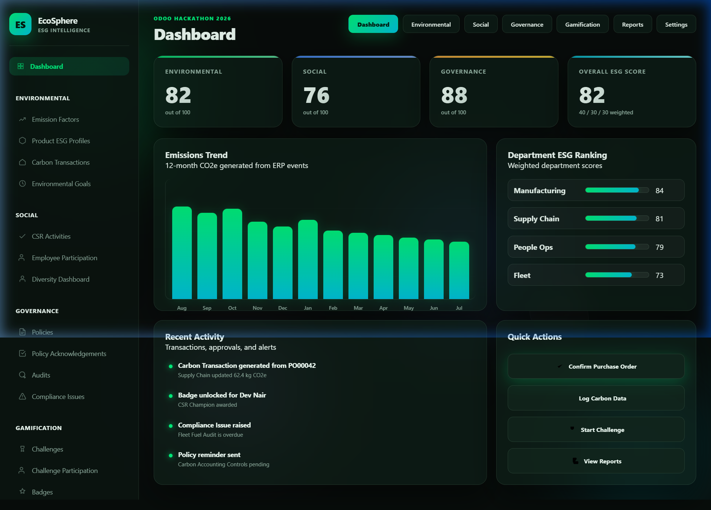
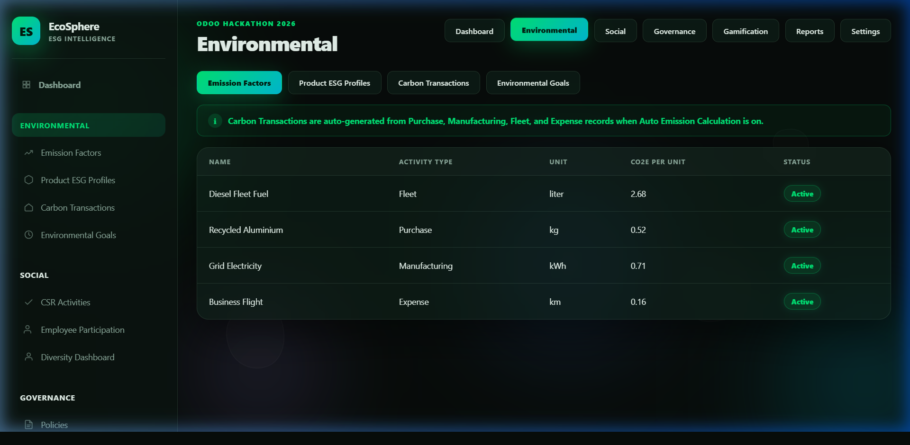
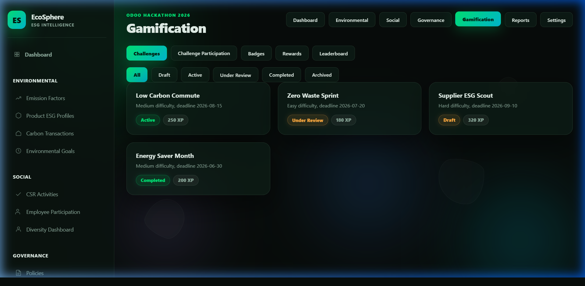

<p align="center">
  
  
  
  
</p>

<h1 align="center">🌿 EcoSphere</h1>
<h3 align="center">ESG Intelligence Platform for Odoo 18</h3>
<p align="center"><em>Turning everyday ERP operations into measurable Environmental, Social, and Governance outcomes.</em></p>

---

## 🎯 What is EcoSphere?

**EcoSphere** is an Odoo 18 module that embeds ESG (Environmental, Social, Governance) management directly into your ERP workflow. Instead of treating sustainability as a separate reporting burden, EcoSphere makes it a natural byproduct of everyday operations — every Purchase Order, Manufacturing Order, Fleet log, and Expense automatically generates carbon transactions and updates department ESG scores in real time.

### The Golden Path

```
Confirm Purchase Order → Carbon Transaction auto-generated → Department Score updated → Overall ESG Score recalculated
```

One click. Zero manual data entry. Full audit trail.

---

## 📸 Screenshots

### Dashboard — Real-time ESG Intelligence
<p align="center">
  
</p>

> The main dashboard shows Environmental (82), Social (76), and Governance (88) scores with a weighted Overall ESG Score. A 12-month emissions trend chart, department ESG rankings, recent activity feed, and quick actions are all visible at a glance.

### Environmental — Emission Factors & Carbon Transactions
<p align="center">
  
</p>

> Manage emission factors (Diesel Fleet Fuel, Recycled Aluminium, Grid Electricity, Business Flights), Product ESG Profiles, Carbon Transactions, and Environmental Goals — all with automatic CO₂e calculation.

### Gamification — Challenges, Badges & Leaderboard
<p align="center">
  
</p>

> Drive employee engagement with ESG challenges (Low Carbon Commute, Zero Waste Sprint), XP-based badges, redeemable rewards, and a live leaderboard.

---

## 🏗️ Architecture

EcoSphere is built as two complementary layers:

```
EcoSphere/
├── ecosphere/                 # 🔧 Odoo 18 Module (Production)
│   ├── __manifest__.py        #    Module metadata & dependencies
│   ├── models/                #    Business logic
│   │   ├── esg_department.py          # ESG departments with hierarchy & weighted scoring
│   │   ├── esg_carbon_transaction.py  # Auto-generated carbon transactions
│   │   ├── esg_emission_factor.py     # CO₂e emission factors per activity type
│   │   ├── esg_category.py            # Shared CSR Activity & Challenge categories
│   │   └── res_config_settings.py     # ESG weight configuration & toggles
│   ├── views/                 #    Odoo XML views, menus & dashboard
│   ├── security/              #    Access rights & role-based security
│   ├── data/                  #    Default config & demo data
│   ├── static/                #    Frontend assets (CSS/JS)
│   └── tests/                 #    Unit tests
│
├── web_preview/               # 🌐 Standalone Interactive Demo
│   ├── index.html             #    Full-featured ESG dashboard preview
│   ├── styles.css             #    Glassmorphism dark theme with animations
│   ├── app.js                 #    State management & interactivity
│   └── server.py              #    Python HTTP server (localhost:8070)
│
└── docs/                      # 📖 Documentation & screenshots
```

### Key Design Decisions

| Decision | Rationale |
|---|---|
| **Separate ESG Department hierarchy** | `hr.employee.esg_department_id` ≠ `hr.employee.department_id` — ESG reporting structure can differ from HR org chart |
| **Weighted ESG scoring** | Configurable weights (default: E 40%, S 30%, G 30%) that must sum to 100% |
| **Auto Emission Calculation** | Enabled by default so the golden path works immediately after install |
| **4 security roles** | ESG Admin, Manager, Employee, Auditor — with granular access control |

---

## 🚀 Quick Start

### Option 1: Interactive Preview (No Odoo Required)

See the full EcoSphere UI instantly with the standalone web preview:

```bash
# Clone the repository
git clone https://github.com/Trunal2005/EcoSphere.git
cd EcoSphere

# Start the preview server
cd web_preview
python server.py
```

Open **http://localhost:8070** in your browser.

> **What you can do in the preview:**
> - Browse all 7 modules (Dashboard, Environmental, Social, Governance, Gamification, Reports, Settings)
> - Click **"Confirm Purchase Order"** to trigger the golden path live
> - Approve/Reject CSR participation requests
> - Redeem gamification rewards
> - Filter challenges by state
> - Explore the custom report builder

### Option 2: Full Odoo Installation

```bash
# 1. Clone into your Odoo addons path
git clone https://github.com/Trunal2005/EcoSphere.git /path/to/odoo/addons/ecosphere

# 2. Update the Odoo addons path in your odoo.conf
addons_path = /path/to/odoo/addons,/path/to/EcoSphere

# 3. Restart Odoo and install
./odoo-bin -u ecosphere -d your_database
```

**Dependencies:** `base`, `hr`, `mail` (standard Odoo modules)

---

## 📊 Modules

### 🌱 Environmental
| Feature | Description |
|---|---|
| **Emission Factors** | Define CO₂e conversion rates per activity type (Purchase, Manufacturing, Fleet, Expense) |
| **Carbon Transactions** | Auto-generated records with calculated CO₂e from ERP events |
| **Product ESG Profiles** | Track recyclability, sustainable sourcing, and linked emission factors |
| **Environmental Goals** | Set per-department CO₂ reduction targets with deadline tracking |

### 👥 Social
| Feature | Description |
|---|---|
| **CSR Activities** | Track corporate social responsibility programs with evidence requirements |
| **Employee Participation** | Approval workflows for CSR participation with point awards |
| **Diversity Dashboard** | Gender balance, training completion, and participation rates |

### 🛡️ Governance
| Feature | Description |
|---|---|
| **Policies** | Publish and track policy acknowledgement rates |
| **Audits** | Record audit findings with linked compliance issues |
| **Compliance Issues** | Severity-based tracking (High/Medium/Low) with owner assignment and due dates |

### 🏆 Gamification
| Feature | Description |
|---|---|
| **Challenges** | ESG challenges with XP rewards, difficulty levels, and state management |
| **Badges** | Auto-awarded badges based on XP thresholds or custom rules |
| **Rewards** | Redeemable rewards with point requirements and stock tracking |
| **Leaderboard** | Company-wide XP rankings to drive engagement |

### 📈 Reports
| Feature | Description |
|---|---|
| **Pre-built Reports** | Environmental, Social, Governance, and ESG Summary reports |
| **Custom Report Builder** | Combine filters (Date, Department, Module, Employee, Category) with PDF/Excel/CSV export |

### ⚙️ Settings
| Feature | Description |
|---|---|
| **ESG Configuration** | Score weights, auto-calculation toggles, evidence requirements |
| **Departments** | ESG department hierarchy (independent from HR org chart) |
| **Categories** | Shared category management for CSR activities and challenges |
| **Notifications** | Configurable alerts for compliance issues, approvals, reminders, and badge awards |

---

## 🔐 Security Roles

| Role | Access |
|---|---|
| **ESG Admin** | Full CRUD access to all ESG models, settings configuration |
| **ESG Manager** | Create/edit departments, categories, emission factors; approve participation |
| **ESG Employee** | Read access to dashboards; submit participation and challenges |
| **ESG Auditor** | Full access to audits and compliance issues; read-only on other data |

---

## 🧪 Testing

```bash
# Run the EcoSphere test suite
./odoo-bin --test-enable -u ecosphere -d test_db --stop-after-init
```

Test coverage includes:
- Department hierarchy recursion prevention
- ESG weight validation (must sum to 100%)
- Carbon transaction CO₂e calculation
- Employee count computation
- Emission factor uniqueness constraints

---

## 🛠️ Tech Stack

| Component | Technology |
|---|---|
| **Backend** | Python 3.12+, Odoo 18 ORM |
| **Frontend (Odoo)** | OWL 2, QWeb templates, Odoo asset pipeline |
| **Frontend (Preview)** | Vanilla HTML5, CSS3, JavaScript ES6+ |
| **Styling** | Glassmorphism dark theme, CSS custom properties, 3D transforms |
| **Animations** | CSS keyframes, requestAnimationFrame counters, parallax effects |
| **Server** | Python ThreadingHTTPServer (preview), Odoo/Werkzeug (production) |

---

## 🗺️ Roadmap

- [x] **Phase 1** — Foundation (Departments, Categories, Settings, Security)
- [x] **Phase 2** — Carbon Engine (Emission Factors, Carbon Transactions, Auto-calculation)
- [ ] **Phase 3** — Social Module (CSR Activities, Participation workflows)
- [ ] **Phase 4** — Governance Module (Policies, Audits, Compliance)
- [ ] **Phase 5** — Gamification Engine (Challenges, Badges, Rewards, Leaderboard)
- [ ] **Phase 6** — Reports & Analytics (Custom report builder, PDF/Excel export)

---

## 👥 Team

**Odoo Hackathon 2026**

---

## 📄 License

This project is licensed under the **LGPL-3.0 License** — see the [LICENSE](LICENSE) file for details.

---

<p align="center">
  <strong>🌍 Making sustainability measurable, one ERP transaction at a time.</strong>
</p>
